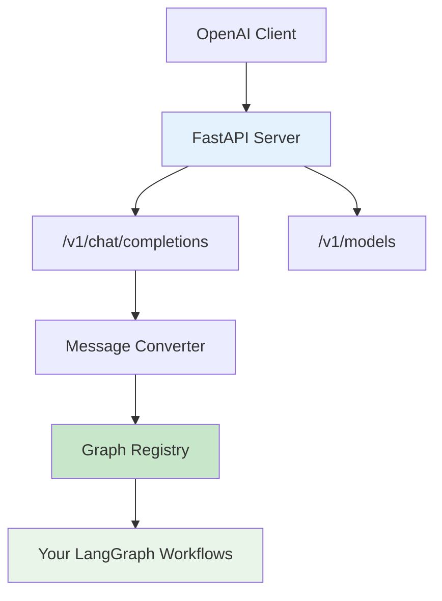



I've been working with LangGraph lately and ran into a problem: how do you expose your custom LangGraph workflows through an API that plays nicely with existing OpenAI tools? That's exactly what **LangGraph OpenAI Serve** solves - it's a Python package that lets you serve your LangGraph instances using the familiar OpenAI API format.

## What is LangGraph OpenAI Serve?

LangGraph OpenAI Serve acts as a bridge between your custom [LangGraph](https://github.com/langchain-ai/langgraph) workflows and the standard OpenAI API. Instead of building your own API from scratch, you can expose your LangGraph instances through endpoints that any OpenAI client can understand.

## Key Features

**OpenAI API Compatibility** - Implements the essential OpenAI endpoints like `/v1/chat/completions` and `/v1/models`

**Multiple Graphs** - Register different LangGraph workflows as different "models" in a single API

**Streaming Support** - Real-time responses that work with OpenAI's streaming format

**FastAPI Integration** - Built on FastAPI, so it integrates well with existing projects

## Architecture



## How it Works

The setup is pretty straightforward. You have your LangGraph workflows, register them with different model names, and the package handles the translation between OpenAI's message format and LangChain's format behind the scenes.

## Getting Started

Install it with uv (recommended) or pip:

```bash
# uv
uv add langgraph-openai-serve

# pip
pip install langgraph-openai-serve
```

Here's a basic example:

```python
from langgraph_openai_serve import LangchainOpenaiApiServe, GraphRegistry, GraphConfig
from your_graphs import simple_graph, advanced_graph

# Create a GraphRegistry
graph_registry = GraphRegistry(
    registry={
        "simple-chat": GraphConfig(
            graph=simple_graph, 
            streamable_node_names=["generate"]
        ),
        "advanced-agent": GraphConfig(
            graph=advanced_graph, 
            streamable_node_names=["reasoning", "response"]
        )
    }
)

# Initialize the server
graph_serve = LangchainOpenaiApiServe(graphs=graph_registry)

# Bind OpenAI-compatible endpoints
graph_serve.bind_openai_chat_completion(prefix="/v1")

# Run the server
if __name__ == "__main__":
    import uvicorn
    uvicorn.run(graph_serve.app, host="0.0.0.0", port=8000)
```

### Using with OpenAI Clients

Once the server is running, you can use any OpenAI client to interact with your custom graphs:

```python
from openai import OpenAI

client = OpenAI(
    base_url="http://localhost:8000/v1",
    api_key="any-value"  # Authentication not enforced by default
)

# Use your custom graph as a "model"
response = client.chat.completions.create(
    model="advanced-agent",  # Your registered graph name
    messages=[
        {"role": "user", "content": "Analyze this business proposal..."}
    ],
    stream=True
)

for chunk in response:
    if chunk.choices[0].delta.content:
        print(chunk.choices[0].delta.content, end="")
```

## Why I Built This

The main problem I was trying to solve was compatibility. I had some complex LangGraph workflows that I wanted to use in applications that were already set up to work with OpenAI's API. Instead of rewriting the client code or building a custom API from scratch, this package lets you keep using the OpenAI format while running your own logic underneath.

It's also useful for:
- Testing different LangGraph workflows by treating them as different "models"
- Integrating custom agents into existing OpenAI-compatible tools
- Gradually migrating from OpenAI to custom solutions without breaking existing code
