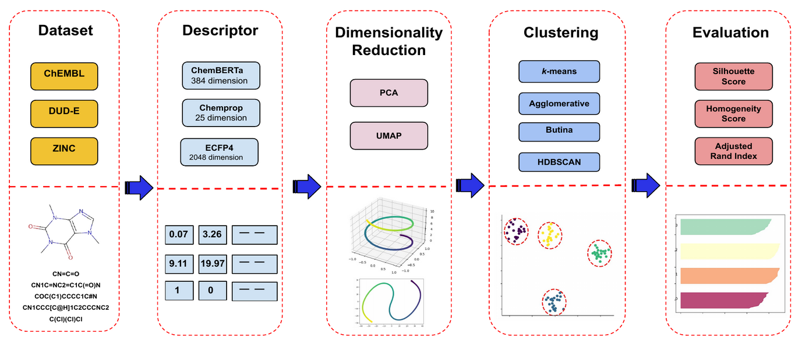



[Thesis Pdf](pdfs/Thesis.pdf)

## Introduction

Due to the abundance of drug candidates, conducting in-lab experiments to find an effective compound for a given target is a costly and time-consuming task in drug discovery. 

This thesis aims to reduce the number of drug candidates during early drug discovery by clustering the compounds. 

ChemBERTa, a Bidirectional Encoder Representation from Transformers (BERT) model, is employed to extract the descriptors for a compound. 

The compounds are clustered with respect to the learned features, and several clustering algorithms, including the k-means clustering algorithm and the Butina algorithm, are used. 

Finally, obtained clusters are evaluated by measures such as the Silhouette Score and Homogeneity Score. 

Our empirical findings show that using learned descriptors of ChemBERTa produces results that are comparable with traditional and graph-based models, as shown by metrics of cluster accuracy and computing runtime.

**Keywords**: drug-target interaction, compound descriptors, representation learning, natural language processing, clustering

## Method

- Our method consists of 5 main stages.
- We use 3 main compound SMILES datasets, with 3 different descriptors.
- We also use dimensionality reduction techniques before clustering.
- We use 4 main clustering algorithm and evaluate their performance with 3 different metrics.

