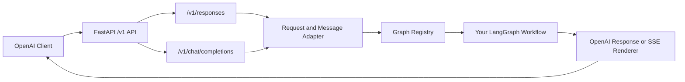



I've been using LangChain and LangGraph since their early days. They have come a long way, and after also trying OpenAI Agents, Haystack, and other frameworks, I keep returning to LangGraph. The control it gives you over a workflow, from a simple graph to a very complex one, feels just right.

However, I kept running into the same problem: how do I deploy my graphs in a way that works nicely with the rest of my stack?

I'm a self-hoster, and I want my stack to be open source and easy to run on my own infrastructure. [LangServe](https://github.com/langchain-ai/langserve) is now deprecated and archived, with LangGraph Platform as the recommended direction. There is also [Aegra](https://github.com/aegra/aegra), a fully self-hostable implementation of the LangGraph Platform API, which I like very much. For my own graphs, though, I wanted something simpler: the familiar OpenAI API.

That's exactly what **LangGraph OpenAI Serve**, or **LGOS**, provides.

## What is LangGraph OpenAI Serve?

LangGraph OpenAI Serve acts as a bridge between your custom [LangGraph](https://github.com/langchain-ai/langgraph) workflows and OpenAI-compatible clients. You register your graphs as different `model` values, and LGOS exposes them through a documented subset of the OpenAI API.

The main endpoints are `/v1/responses`, `/v1/chat/completions`, and `/v1/models`. The Responses API is the recommended choice for new integrations and advanced workflow features. Chat Completions remains available for clients that use the simpler API.

LGOS does not claim to implement every feature offered by OpenAI. Unsupported fields are rejected clearly instead of being silently ignored. The complete contract is documented in the [OpenAI compatibility guide](https://ilkersigirci.github.io/langgraph-openai-serve/latest/explanation/openai-compatibility/).

## Key Features

**Responses and Chat Completions** - Use the modern Responses API or connect existing Chat Completions clients.

**Multiple Graphs** - Register different LangGraph workflows as different OpenAI `model` values in the same FastAPI application.

**Streaming Support** - Use both streaming and non-streaming execution. Graph authors choose which nodes can contribute public assistant text.

**Tools and Human-in-the-Loop** - Support client-executed function tools, [graph-hosted tools](https://ilkersigirci.github.io/langgraph-openai-serve/latest/demo/graphs/hosted-tool/), and durable [LangGraph interrupts](https://ilkersigirci.github.io/langgraph-openai-serve/latest/demo/graphs/interruptible-approval/) represented as Responses API function calls.

**Runtime Settings, Events, and Citations** - Publish typed [runtime settings](https://ilkersigirci.github.io/langgraph-openai-serve/latest/how-to-guides/langgraph-runtime-settings/) to compatible UIs, stream graph-authored status updates, and return structured [citations](https://ilkersigirci.github.io/langgraph-openai-serve/latest/demo/graphs/events-and-citations/).

**File Input** - Accept OpenAI `input_file` parts using opaque file IDs. The graph decides how to resolve and use the file, while upload and storage remain the responsibility of a separate Files API. See the [file-input demo](https://ilkersigirci.github.io/langgraph-openai-serve/latest/demo/graphs/file-input/).

**Optional Persistence** - Use PostgreSQL for durable interrupt checkpoints, cross-worker coordination, and explicit application data through [LangGraph Store](https://ilkersigirci.github.io/langgraph-openai-serve/latest/demo/graphs/persistent-plot-agent/).

**FastAPI and Observability** - Add LGOS to an existing FastAPI application and use optional Langfuse tracing or OpenTelemetry instrumentation.

## Architecture



## How it Works

The setup is straightforward. You register your LangGraph workflows with different model names, and LGOS handles the translation between OpenAI request objects, LangChain messages, graph input, and OpenAI responses.

One important part of the design is state ownership. For ordinary conversations, LGOS does not store the user's chat transcript. The UI or client owns the conversation and resends the required history with each request. This keeps the ordinary conversation path stateless and makes it easier to scale horizontally.

Stateful features are still supported where they are actually needed. Human-in-the-loop execution can keep a pending checkpoint until the client sends an answer. A graph can also use LangGraph Store for its own application data. This state is separate from UI chat history.

The same idea applies to files. LGOS accepts OpenAI file IDs, but the package itself does not own file upload or storage. You can connect a separate OpenAI-compatible Files API, use a gateway-native provider, or start the S3-backed Files API included in the demo.

## Getting Started

Install it with uv (recommended) or pip:

```bash
# uv
uv add langgraph-openai-serve

# pip
pip install langgraph-openai-serve
```

Here's a basic example:

```python
from fastapi import FastAPI
from langgraph_openai_serve import (
    GraphConfig,
    GraphRegistry,
    LanggraphOpenaiServe,
)

from your_graphs import my_graph

app = FastAPI()
graphs = GraphRegistry(
    registry={
        "my-graph": GraphConfig(
            graph=my_graph,
            description="Answer questions with my LangGraph workflow.",
            streamable_node_names=["generate"],
        )
    },
)

LanggraphOpenaiServe(app=app, graphs=graphs).bind_openai_api()
```

Run the application with Uvicorn:

```bash
uvicorn app:app --reload
```

### Using with OpenAI Clients

Once the server is running, use the normal OpenAI client and select your registered graph as the model:

```python
from openai import OpenAI

client = OpenAI(
    base_url="http://localhost:8000/v1",
    api_key="DUMMY",
)

response = client.responses.create(
    model="my-graph",
    input="Hello from an OpenAI client",
    store=False,
)

print(response.output_text)
```

The dummy key only satisfies the SDK in a local keyless setup. LGOS does not enforce authentication by default, so your host FastAPI application should add the authentication required by your deployment.

## The Demo Stack

I have built a [self-contained demo](https://ilkersigirci.github.io/langgraph-openai-serve/latest/demo/) to show how the whole stack works together. It includes documented [example graphs](https://ilkersigirci.github.io/langgraph-openai-serve/latest/demo/graphs/), Chainlit, Open WebUI, PostgreSQL, an S3-backed Files API, and selectable LiteLLM or Bifrost routing.

The graph examples cover simple graphs, tools, RAG, citations, runtime settings, files, subgraphs, persistent Store data, and human-in-the-loop execution. The stack also supports optional OpenTelemetry collection and native Langfuse tracing, so I can observe a request from the UI and gateway down into the graph execution.

Prepare the environment and run the published stack with:

```bash
cd demo
cp .env.example .env
make compose
```


## Why I Built This

The main problem I wanted to solve was compatibility. I had complex LangGraph workflows that I wanted to use in applications already built around the OpenAI API. Instead of rewriting client code or creating another custom protocol, LGOS lets me keep using the OpenAI format while running my own graphs underneath.

This also means I can use the same graphs from [Open WebUI](https://github.com/open-webui/open-webui), [Chainlit](https://github.com/Chainlit/chainlit), and other compatible clients. I can also route them through gateways such as [Bifrost](https://github.com/maximhq/bifrost) or [LiteLLM](https://github.com/BerriAI/litellm). Their normalized APIs sometimes have different compatibility boundaries, which I test and document in the project.

It's also useful for:

- Testing different LangGraph workflows by treating them as different models
- Integrating custom graphs and agents into existing OpenAI-compatible tools
- Keeping ordinary chat history in the UI while using durable graph state only where needed
- Deploying multiple graph services behind the same OpenAI-compatible gateway

I have tested LGOS with some very complex graphs, and it works wonderfully for my needs. I welcome you to create whatever graph you can think of. The sky is the limit :) Let's find out together whether LGOS supports your use case. If something does not work, I would like to support it where possible without breaking the OpenAI API contract.

LGOS is MIT licensed and will remain open source and free. Take a look at the [repository](https://github.com/ilkersigirci/langgraph-openai-serve), explore the examples, and let me know what you build.
